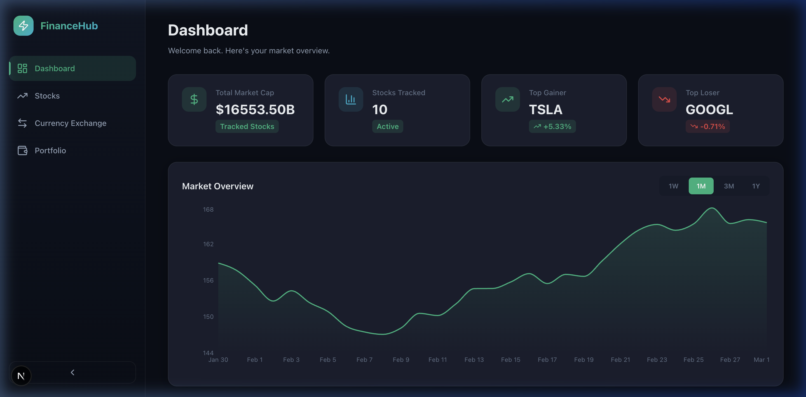
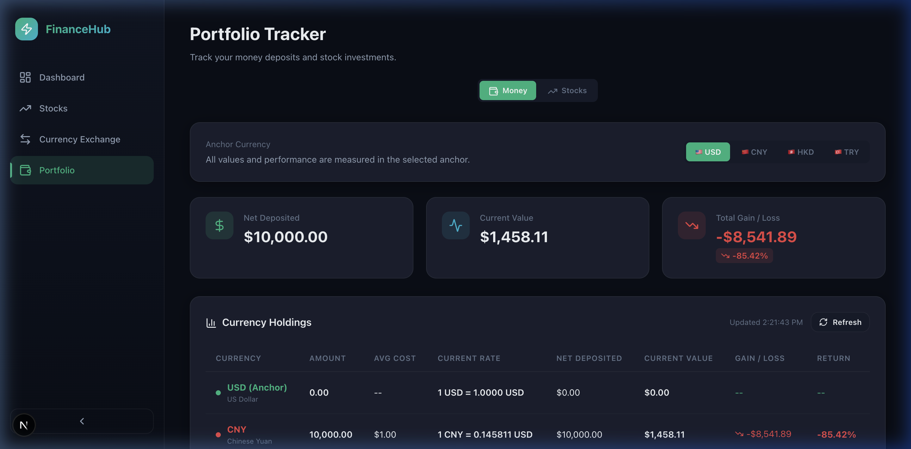

# SPYM / QQQM / SCHD Tracker

A modern, dark-themed personal finance dashboard for tracking **SPYM**, **QQQM**, and **SCHD** ETF investments — with real-time stock prices, multi-currency deposit management, live exchange rates, and interactive charts.

Built with **Next.js 16**, **TypeScript**, and **Recharts**.



---

## ✨ Features

### 📊 Dashboard
- **Live** market overview with ETF avg performance, top gainers/losers
- Switch between SPYM / QQQM / SCHD price charts with 1W / 1M / 3M / 1Y ranges
- Live currency exchange rate cards (USD, CNY, HKD, TRY) from ECB
- ETF summary table with real-time price, change, and volume
- One-click refresh for all live data

### 📈 Stock Tracker
- Live quotes for **SPYM**, **QQQM**, and **SCHD** ETFs
- Price history charts with configurable time ranges
- Key stats: open, high, low, volume, market cap, 52-week range

### 💰 Portfolio Tracker
Two tabs for complete portfolio management:

**Money Tab** — Track currency deposits across USD, CNY, HKD, and TRY:
- Set an anchor currency for unified gain/loss calculations
- Log deposit & withdrawal transactions with exchange rates
- View net deposited, current value, and total return per currency
- Calculation breakdowns on hover for full transparency

**Stocks Tab** — Track ETF buy/sell transactions:
- Log share purchases with date and price
- Real-time portfolio valuation using live market prices
- Per-symbol breakdown: shares held, avg cost, current value, gain/loss
- Persistent storage — your data survives browser refreshes

### 💱 Currency Exchange
- Live exchange rates between USD, CNY, HKD, and TRY (via [Frankfurter API](https://www.frankfurter.app/))
- Currency converter with swap functionality
- Historical rate charts with 1W / 1M / 3M / 6M / 1Y ranges
- Cross-rate table for all tracked currency pairs



---

## 🚀 Getting Started

### Prerequisites
- **Node.js** 18+ and **npm** (or yarn / pnpm / bun)

### Installation

```bash
# Clone the repository
git clone https://github.com/BelongToMachine/SPYM-QQQM-SCHD-tracker.git
cd SPYM-QQQM-SCHD-tracker

# Install dependencies
npm install
```

### Running the App

```bash
npm run dev
```

Open [http://localhost:3000](http://localhost:3000) in your browser.

---

## 📁 Project Structure

```
├── src/
│   ├── app/
│   │   ├── page.tsx              # Dashboard (home page)
│   │   ├── stocks/page.tsx       # Stock quotes & charts
│   │   ├── currency/page.tsx     # Currency exchange & converter
│   │   ├── portfolio/page.tsx    # Portfolio tracker (Money + Stocks tabs)
│   │   ├── api/
│   │   │   ├── stocks/route.ts   # Proxy for Yahoo Finance API
│   │   │   ├── portfolio/route.ts # CRUD for stock transactions
│   │   │   └── money/route.ts    # CRUD for money transactions
│   │   ├── globals.css           # Design system & all styles
│   │   └── layout.tsx            # Root layout with sidebar
│   ├── components/
│   │   ├── Sidebar.tsx           # Navigation sidebar
│   │   └── portfolio/
│   │       ├── MoneyTracker.tsx   # Money deposits tracker component
│   │       └── StocksTracker.tsx  # Stock investment tracker component
│   └── lib/
│       ├── stock-api.ts          # Stock API client (Yahoo Finance)
│       ├── currency-api.ts       # Currency API client (Frankfurter)
│       └── data.ts               # Static data & helpers
├── data/                         # Local JSON database (gitignored)
│   ├── portfolio.json            # Stock transactions (personal data)
│   └── money.json                # Money transactions (personal data)
├── public/                       # Static assets
└── package.json
```

---

## 🔌 APIs Used

| API | Purpose | Auth Required |
|-----|---------|:---:|
| [Yahoo Finance](https://finance.yahoo.com/) | Real-time stock quotes & price history | No |
| [Frankfurter](https://www.frankfurter.app/) | Live & historical exchange rates (ECB data) | No |

> Both APIs are free and require no API keys. Stock data is proxied through `/api/stocks` to avoid CORS issues.

---

## 💾 Data Storage

Transaction data is stored locally in JSON files under the `data/` directory:
- `data/portfolio.json` — Stock buy/sell transactions
- `data/money.json` — Currency deposit/withdrawal transactions

These files are **gitignored** to keep your personal financial data private. They are created automatically when you add your first transaction.

---

## 🛠 Tech Stack

- **Framework**: [Next.js 16](https://nextjs.org/) (App Router)
- **Language**: TypeScript
- **Charts**: [Recharts](https://recharts.org/)
- **Icons**: [Lucide React](https://lucide.dev/)
- **Styling**: Vanilla CSS with custom design system (dark theme, glassmorphism, micro-animations)

---

## 📄 License

This project is for personal use. Feel free to fork and customize for your own portfolio tracking needs.
